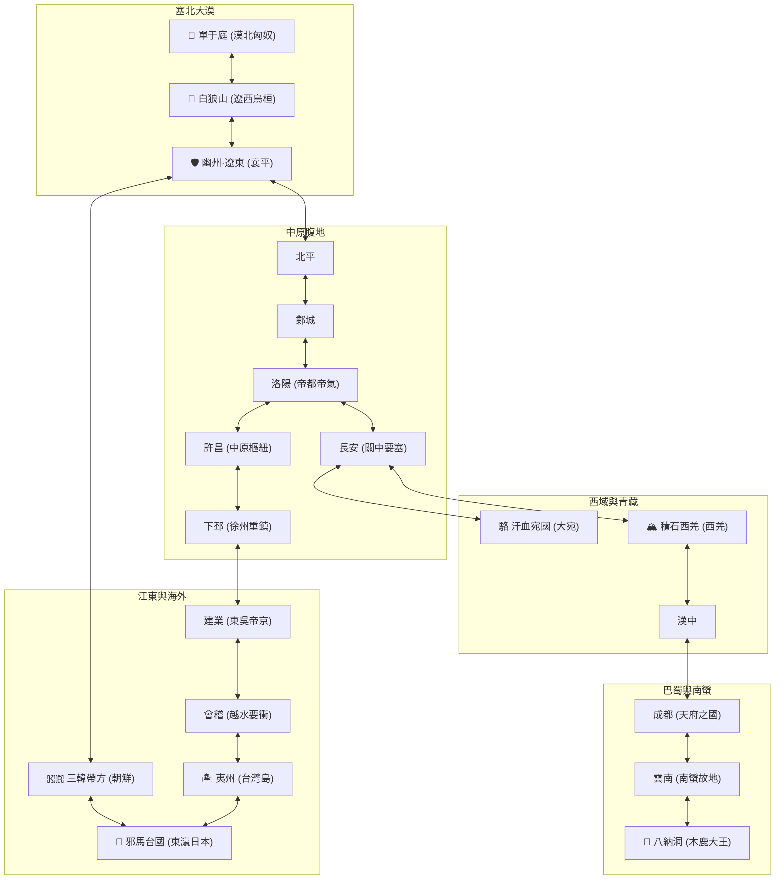
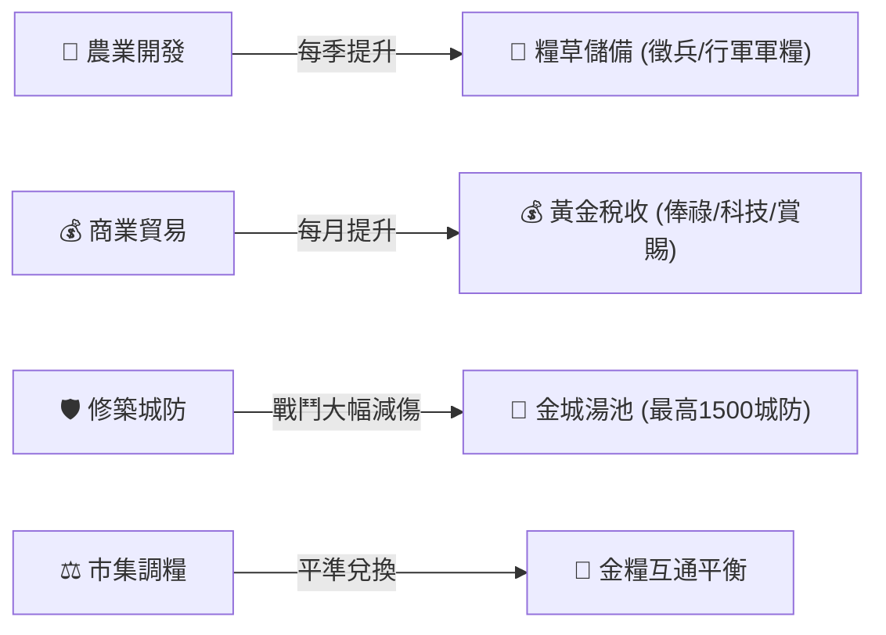
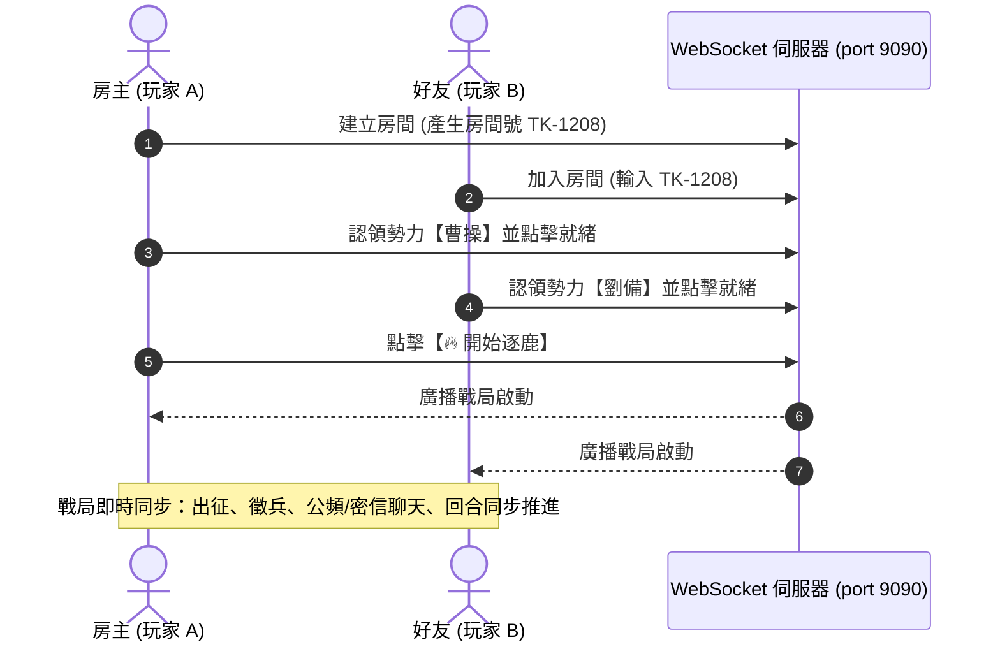
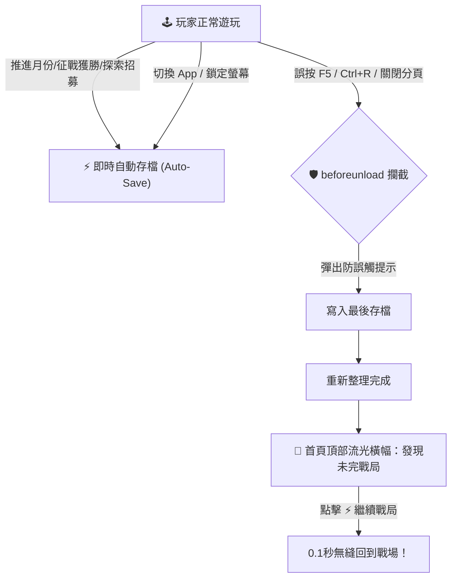

# 📜《三國志：逐鹿中原・天下歸一》官方全系統終極遊戲手冊 (Master Manual)

> 🎮 **線上即玩網址 (GitHub Pages)**: [https://liarychang.github.io/three-kingdoms/](https://liarychang.github.io/three-kingdoms/)  
> 🖥️ **本地端網址**: [http://localhost:9090](http://localhost:9090)

---

## 🌟 序言：大爭之世，唯強者定鼎中原

《三國志：逐鹿中原》是一款融合了**大地圖宏觀戰略、深度內政經濟、兵種相剋戰術、武將 RPG 自由加點、家族宗室繁衍、軍略府科技樹、36 件上古秘寶、異時空穿越歷史奇遇、動態天災抗災、防誤觸自動存檔恢復** 以及 **多人線上即時對戰** 的史詩級策略模擬遊戲。

本手冊為全體主公提供最詳盡、最權威的系統機制說明與高階霸業指南。

---

## 🗺️ 第一章：大東亞天下全圖與 30 邦國地理

遊戲地圖橫跨中原腹地、長江流域、巴蜀天險、塞外大漠乃至海東諸島，共由 **30 座名城要塞與異域邦國** 組成，內嵌 **52 條陸行大道與海東航線**。



### 🌍 八大異域邦國與戰略要地特點
1. 🌸 **【邪馬台國】**（東瀛日本）：女王卑彌呼統治，智略與水戰防禦極高，產出上古神物【八咫鏡】。
2. 🏝️ **【夷州】**（海東海島・台灣島）：造船遠航起點，四季如春，農業開發潛力巨大。
3. 🇰🇷 **【三韓帶方】**（朝鮮半島）：三韓重鎮，扼守東北亞咽喉海道。
4. 🐎 **【單于庭】**（漠北大漠）：匈奴王庭，盛產頂級戰馬與弓騎兵。
5. 🏹 **【白狼山】**（遼西塞外）：烏桓雄踞之地，地形險峻，騎兵衝鋒加成。
6. 🐫 **【汗血宛國】**（西域大宛）：絲路綠洲，可獲取神駿【大宛汗血天馬】。
7. 🏔️ **【積石西羌】**（青藏雪域）：西羌王國，步兵擅長雪原山地作戰。
8. 🐘 **【八納洞】**（極南雨林）：木鹿大王象兵洞穴，產出【南蠻戰象王】與毒瘴藤甲。

### 🏰 六大城池歷史戰略特產 (City Specialties)
* 👑 **【帝都樞紐】**（洛陽、長安、鄴、建業、成都）：天下大邑，季收稅金 +30%，民心士氣提升。
* 🛡️ **【天險要塞】**（天水、漢中、晉陽、北平、遼東、敦煌）：易守難攻，城防減傷上限高。
* 🐎 **【名馬產地】**（匈奴、烏桓、西羌、大宛）：每季自動培育戰馬，騎兵徵召成本降低。
* 💰 **【繁華商埠】**（壽春、柴桑、會稽、交趾）：通商海外，每月金錢收入 +20%。
* 🌾 **【天府沃土】**（成都、許昌、汝南）：沃野千里，每季糧草大豐收產量 +25%。
* 🐘 **【巨象藤甲】**（八納洞、雲南）：南蠻精銳兵種，享有象兵衝鋒與藤甲減傷。

---

## 📜 第二章：四大經典劇本與自創君主立足

| 劇本名稱 | 年代 | 歷史背景 | 推薦新手君主 |
| :--- | :---: | :--- | :--- |
| 🌾 **黃巾之亂** | 184 年 | 張角掀起黃巾狂潮，天下大亂，朝廷命何進率各路豪傑平叛 | 何進（兵強馬壯）、曹操（人才濟濟） |
| ⚔️ **反董卓聯盟** | 190 年 | 董卓火燒洛陽挾天子遷長安，關東十八路諸侯歃血討董 | 袁紹（名望盟主）、孫堅（猛虎先鋒） |
| 👑 **群雄割據** | 194 年 | 呂布誅董卓，曹操起兗州，孫策平江東，劉備鎮徐州 | 曹操（中原核心）、劉備（關張相隨） |
| 🐉 **三顧茅廬** | 207 年 | 劉備三顧隆中請臥龍，孔明出山三分天下，赤壁大戰一觸即發 | 劉備（臥龍出山）、孫權（江東天險） |

### 👑 自創君主立足模式 (Custom Lord)
* **自由訂製**：自訂君主姓名、表字、頭像、起兵都城（30 城任選）、專屬軍旗色彩與旗號文字。
* **五維屬性池分配**：400 點屬性自由分配於【統率、武力、智力、政治、魅力】。
* **自創專屬天賦**：可選擇【武聖（戰鬥傷害+30%）、神算（計略必成）、飛將（突擊+50%）、仁德（士氣自增）、霸道（稅收+30%）、鐵騎（騎兵威力大增）】等強大君主特技。

---

## 🏛️ 第三章：內政經營、富國強兵與四季時令



### 🌸 四季動態天候時令與粒子氛圍 (Seasons System)
* 🌸 **【春生（1~3月）】**：農耕增益 +30%，適合全境大力屯田；地圖飄落櫻花花瓣 🌸。
* ☀️ **【夏長（4~6月）】**：商業貿易增益 +20%，火計威力提升 25%；地圖映照微金暖陽 ☀️。
* 🍁 **【秋收（7~9月）】**：年度大徵收，糧草儲備暴增 +20%；地圖飄揚金紅楓葉 🍁。
* ❄️ **【冬藏（10~12月）】**：部隊消耗降低 20%，行軍速度減緩；塞北與中原漫天飄雪 ❄️。

---

## ⚔️ 第四章：兵種相剋、攻城戰略與沙場單挑

### 1. 兵種相剋循環閉環 (30% 剋制增傷)
$$\text{騎兵 (Cavalry)} \xrightarrow{\text{衝鋒踏破 (+30\%)}} \text{步兵 (Infantry)} \xrightarrow{\text{持盾推進 (+30\%)}} \text{弓兵 (Archer)} \xrightarrow{\text{密集群射 (+30\%)}} \text{騎兵 (Cavalry)}$$

### 2. 攻城與破城要訣
* **城防減傷**：當守方城防大於 500 時，享有極高防禦減傷。
* **霹靂破城**：指派高統率將領研發【霹靂投石】或裝備攻城兵器，可每回合重創敵方城防。
* **士氣崩潰**：部隊士氣低於 20 時將引發大潰逃，士氣 100 滿值時觸發爆擊！

### 3. 🥋 世紀武將單挑 (Duel Arena)
* 戰場交鋒時有機率觸發單挑，雙方大將於沙場對峙：
  * **【猛攻】**：爆發 120% 攻擊力。
  * **【防守反擊】**：減免 50% 傷害並於下回合必暴擊反擊。
  * **【奧義必殺】**：消耗滿鬥氣釋放專屬絕技（關羽「青龍破天」、呂布「無雙天下」、趙雲「百鳥朝鳳」）！
* 單挑獲勝方全軍士氣暴增 +30，敗方部隊潰散並折損 15%~20% 兵力！

---

## 🎖️ 第五章：130 位名將仙真、RPG 升級與朝廷官爵

### 1. 跨時代名將與隱世仙真陣容
* ⚡ **【西楚霸王・項羽】**（武 100 / 統 98 / 魅 95）: 破城霸王，千古無二。
* 🏹 **【冠軍侯・霍去病】**（統 97 / 武 96 / 智 78）: 封狼居胥，千里奔襲。
* ⚔️ **【大秦殺神・白起】**（統 100 / 智 95 / 武 91）: 大秦武安君，百戰不殆。
* 🍷 **【盛唐詩仙・李白】**（魅 100 / 智 96 / 武 85）: 仗劍天涯，詩酒論道。
* 📱 **【現代工程學者・楚天行】**（智 99 / 政 95 / 統 82）: 現代冶金，工業革命。
* 🧙‍♂️ **【南華老仙】**（智 100） / **【于吉仙人】**（智 98） / **【神卜管輅】**（智 97） / **【槍神童淵】**（武 99）。

### 2. 📈 RPG 戰功升級與自由加點
* 武將執行內政、參與戰鬥將持續累積**戰功經驗值**。
* 每次升級獲得**自由屬性點**，可隨心分配給【統率、武力、智力、政治、魅力】！

### 3. 📜 朝廷官爵冊封之路
$$\text{刺史} \rightarrow \text{州牧} \rightarrow \text{車騎將軍} \rightarrow \text{大將軍} \rightarrow \text{丞相} \rightarrow \text{九錫稱王} \rightarrow \text{受禪稱帝}$$
* 每次晉爵可冊封麾下名將為【大都督、五虎大將、大司馬】，全面提升全軍戰力！

---

## 💍 第六章：家族子嗣府、名將聯姻與良師教導

* 點擊頂部 **`👶 家族`** 按鈕進入宗室府：
  * **正室聯姻**：可與親密度達到 80 以上之麾下名將締結婚約結為正室。
  * **誕育子嗣**：隨著歲月流逝誕生宗室麟兒與少主。
  * **指派良師**：指派孔明、周瑜、司馬懿等名師親自教導文韜武略。
  * **及冠出仕**：子嗣年滿 16 歲及冠成年，自動化為專屬名將效力主公！

---

## 🔬 第七章：軍略府 4 階科技樹與精銳特殊兵種

| 科技類別 | 科技名稱 | 階級 | 研發需求 | 科技效果與解鎖精銳兵種 |
| :--- | :--- | :---: | :--- | :--- |
| ⚔️ 軍事 | **鍛鐵精甲** | 1 階 | 2000 金 / 5000 糧 | 全軍基礎攻擊 +10%，防禦 +10% |
| ⚔️ 軍事 | **藤甲盾陣** | 2 階 | 3500 金 / 8750 糧 | 步兵減傷 +20%，解鎖【藤甲重步兵】（防禦 +40%） |
| ⚔️ 軍事 | **良駒繁育** | 2 階 | 3500 金 / 8750 糧 | 騎兵傷害 +25%，解鎖【精銳重騎兵】（攻擊 +30%） |
| ⚔️ 軍事 | **諸葛連弩** | 2 階 | 3500 金 / 8750 糧 | 弓兵射速大增，解鎖【諸葛連弩兵】（機率二連射） |
| ⚔️ 軍事 | **霹靂投石** | 3 階 | 5000 金 / 12500 糧 | 攻城每回合破壞敵城防，解鎖【霹靂投石車】 |
| ⚔️ 軍事 | **虎豹驍騎** | 3 階 | 6000 金 / 15000 糧 | 曹魏天下精銳，解鎖【虎豹騎】（衝鋒無視城防減免） |
| ⚔️ 軍事 | **陷陣死士** | 4 階 | 8000 金 / 20000 糧 | 全軍士氣上限提升至 120，解鎖傳奇【陷陣營】 |
| 🏛️ 內政 | **軍民屯田** | 1 階 | 2000 金 / 5000 糧 | 每季全領地糧草收成額外提升 +25% |
| 🏛️ 內政 | **鹽鐵官營** | 1 階 | 2000 金 / 5000 糧 | 每月全領地商業稅收額外提升 +25% |
| 🏛️ 內政 | **水利深渠** | 2 階 | 4000 金 / 10000 糧 | 疏通江河修築灌渠，永久免疫天災糧草損失 |
| 🏛️ 內政 | **金城深塹** | 2 階 | 4500 金 / 11250 糧 | 所有城池城防上限提升至 1500，每月自動修復 +10 |
| 🏛️ 內政 | **九品官人** | 3 階 | 6000 金 / 15000 糧 | 登庸人才成功率 +25%，且武將忠誠度不再自然衰減 |
| 🏛️ 內政 | **帝王霸業** | 4 階 | 10000 金 / 25000 糧 | 威加海內，每月民心士氣自動上升，外交親善效果翻倍 |

---

## 💎 第八章：36 件上古神兵秘寶與天下探索

```mermaid
graph LR
    subgraph 🗡️ 神兵利器
        T1["軒轅夏禹劍 (武+15 統+10)"]
        T2["方天畫戟 (武+12 暴擊)"]
        T3["青龍偃月刀 (武+10 斬殺)"]
        T4["丈八蛇矛 (武+10 橫掃)"]
        T5["龍膽亮銀槍 (武+10 破陣)"]
    end

    subgraph 📜 絕世奇書
        B1["太公六韜 (智+12 統+8)"]
        B2["孫子兵法 (智+10 統+10)"]
        B3["太平要術 (智+10 呼風喚雨)"]
        B4["遁甲天書 (智+10 奇門遁甲)"]
        B5["青囊書 (智+8 華佗醫道)"]
    end

    subgraph 🐎 神駿天馬
        H1["赤兔神駒 (統+10 移速+100%)"]
        H2["大宛汗血天馬 (統+8 移速+80%)"]
        H3["南蠻戰象王 (統+10 踐踏)"]
        H4["爪黃飛電 (統+8 突圍)"]
    end

    subgraph 🔮 玉璽天寶
        J1["傳國玉璽 (全屬性+5 威望+100)"]
        J2["華夏九鼎 (全屬性+5 國運昌隆)"]
        J3["親魏倭王金印 (魅+10 外交翻倍)"]
        J4["八咫神鏡 (智+10 破除幻術)"]
    end
```

* **尋寶機制**：指派智力 85 以上名將於各地重鎮執行【探索】，有機率發掘出失落之上古秘寶！

---

## 🌪️ 第九章：25 部史詩劇情、異時空穿越與動態天災

### 1. 🌀 異時空穿越劇情
* ⚡ **185 年【西楚霸王項羽降世】**：烏江時空逆流，項羽跨烏騅馬踏入三國（武力 100）！
* 🐎 **187 年【冠軍侯霍去病封狼居胥】**：霍去病率八百精銳鐵騎馳騁漠北單于庭！
* ⚔️ **191 年【大秦武安君白起現世】**：戰國殺神白起出任軍師上將軍，全領地防禦永久提升！
* ⚙️ **193 年【現代科技穿越・高爐百煉鋼】**：楚天行建造現代高爐，引發軍工革命！
* 🍷 **196 年【詩劍雙絕・詩仙李白醉遊三國】**：李白賦詩《俠客行》，主公魅力+10，將士忠誠滿值！
* 📱 **201 年【未來預知・天降未來史書黑匣】**：挖出未來太陽能情報平板，洞悉天下先機，全將領智力+8！

### 2. 經典歷史劇情
* 🍷 **青梅煮酒論英雄**（韜晦落箸 vs 豪氣干雲）
* ⚔️ **關羽千里走單騎**（忠義感召，威震華夏）
* 🌪️ **七星壇借東風**（散髮步罡，借得東南大風）
* 👑 **邪馬台朝貢冊封親魏倭王**（賜金印紫綬與八咫神鏡）

### 3. 動態天災抗災決策 (每月 30% 機率)
* 🦗 **【赤地蝗災】**：可選「開倉賑民」大獲民心，或「嚴防飢變」。
* 🌊 **【江河決堤】**：可選「派遣工匠修築堤壩」永久提升城防！
* 🦠 **【傷寒大疫】**：可選「求取神農仙藥」徹底治癒全軍！
* 👹 **【黑山盜夜襲】**：設伏圍剿，斬殺匪首繳獲大量黃金與糧草！

---

## 🌐 第十章：多人線上 WebSocket 房間對戰



1. **建立房間**：點擊頂部 **`🌐 多人`**，輸入暱稱建立專屬 4 位房間號。
2. **加入與認領**：好友輸入房間號加入，各自認領不同君主勢力。
3. **即時廣播**：出征討伐、徵兵、研發全域即時廣播，全員結束本月後統一推進下月！
4. **👥 同機熱座模式 (Hot-seat)**：一台電腦上支援 2～8 位玩家輪流操控不同勢力。

---

## 🛡️ 第十一章：防誤觸重整與智慧自動存檔恢復



1. **雙重防誤觸攔截**：戰局進行中若誤觸 F5、Ctrl+R 或關閉分頁，瀏覽器立即彈窗確認，並在離開前瞬間保存進度。
2. **全時段自動存檔**：每回合推進、重大操作、App 切換背景皆自動寫入 `LocalStorage`。
3. **一鍵戰局恢復**：重新載入網頁後，開局選單頂部常駐金色流光橫幅 **`⚡ 發現上次未完戰局【君主・勢力】`**，點擊 **`[⚡ 繼續戰局]`** 即可 0.1 秒無縫重返戰場！

---

## ⌨️ 第十二章：模組化指令中樞與全套鍵盤快速鍵

### 🎛️ 1. 右側面板「獨立模組化指令中樞（Command Deck）」
* 🏛️ **【內政發展】**：`[🌾 開發]` `[💰 商業]` `[⚖️ 交易]` `[🛡️ 修築]` `[🔬 科技]`
* ⚔️ **【軍事征伐】**：`[🛡️ 徵兵]` `[🥋 訓練]` `[🐎 移動]` `[⚔️ 出征]`（赤紅高亮）
* 🧑‍💼 **【人才與外交】**：`[🔍 探索]` `[📜 登用]` `[🎁 賞賜]` `[🗣️ 計略]` `[🤝 外交]`

### 👑 2. 領地導航與時間推進
* 👑 **我方領地快速導航欄**：地圖上方膠囊列表，點擊任意城池直達該城。
* 👑 **傳國玉璽時間推進按鈕**：右下角懸浮獨立金印按鈕，點擊或按 `Space` 隨時推進至下個月！

### ⌨️ 3. 全套鍵盤快速鍵 (Hotkeys)

| 按鍵 | 功能說明 |
| :--- | :--- |
| `Space` / `Ctrl + Enter` | **結束本月**（時間推進至下個月） |
| `[` / `]` 或 `Tab` | **切換上一座 / 下一座我方城池** |
| `A` | **出征討伐** (Attack) |
| `M` | **部隊移動** (Move) |
| `R` | **徵兵擴軍** (Recruit) |
| `D` | **農商開發** (Develop) |
| `S` | **人才探索** (Search) |
| `Esc` | **取消目標選取 / 關閉所有彈窗** |

---

### 🚀 本地開發與伺服器指令

```bash
# 啟動整合式 Node.js HTTP & WebSocket 多人伺服器
node server.js

# 瀏覽器訪問
http://localhost:9090
```
